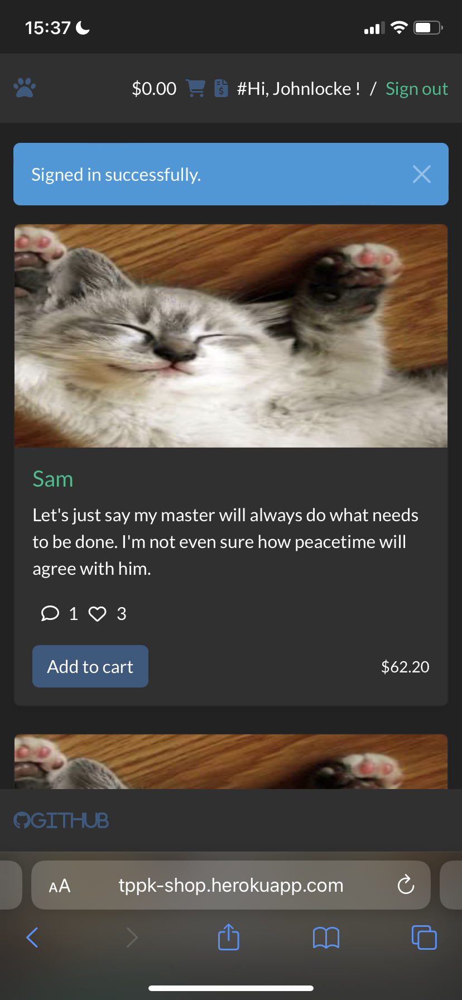
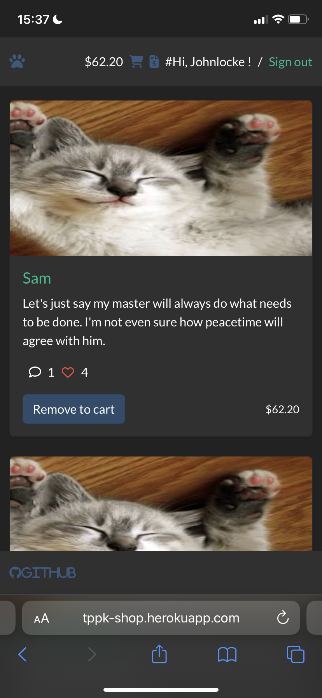
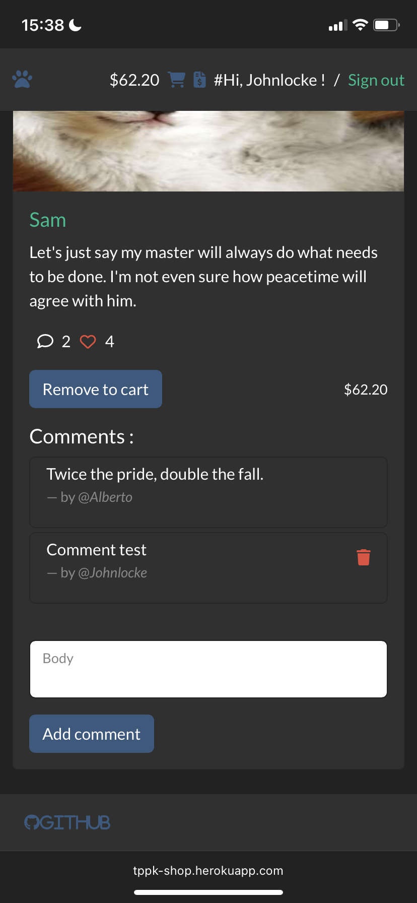

<!-- PROJECT LOGO -->
<br />
<div align="center">
  <a href="https://github.com/Tepepeka/meow_wars">
    
  </a>

  <h3 align="center">Meow Wars</h3>

  <p align="center">
    <a href="https://github1s.com/Tepepeka/meow_wars"><strong>Explore the docs »</strong></a>
    <br />
    <a href="https://tppk-shop.herokuapp.com">View Demo</a>  
  </p>
</div>

<!-- TABLE OF CONTENTS -->
<details>
  <summary>Table of Contents</summary>
  <ol>
    <li>
      <a href="#about-the-project">About The Project</a>
      <ul>
        <li><a href="#built-with">Built With</a></li>
      </ul>
    </li>
    <li>
      <a href="#getting-started">Getting Started</a>
      <ul>
        <li><a href="#prerequisites">Prerequisites</a></li>
        <li><a href="#installation">Installation</a></li>
      </ul>
    </li>
    <li><a href="#contact">Contact</a></li>
    <li><a href="#acknowledgments">Acknowledgments</a></li>
  </ol>
</details>

<!-- ABOUT THE PROJECT -->
## About The Project



This is an e-commerce site for buy some funny kitten pics.<br />
You can :
* Buy a product with a quantity
* Comment a product
* Like a product
* Have an admin

<p align="right">(<a href="#readme-top">back to top</a>)</p>

### Built With

* [![Bootstrap][Bootstrap.com]][Bootstrap-url]
* [![Rails][Rails.com]][Rails-url]

<p align="right">(<a href="#readme-top">back to top</a>)</p>

<!-- GETTING STARTED -->
## Getting Started

### Prerequisites

To use this software you need :
* RVM
```sh
  gpg2 --keyserver keyserver.ubuntu.com --recv-keys 409B6B1796C275462A1703113804BB82D39DC0E3 7D2BAF1CF37B13E2069D6956105BD0E739499BDB
```
* Ruby
```sh
  curl -sSL https://get.rvm.io | bash -s stable
```
* Rails
```sh
  gem install rails
```

### Installation

1. Get some free API Keys at :
* https://sendgrid.com
* https://console.cloud.google.com
* https://stripe.com
2. Clone the repo
  ```sh
   git clone https://github.com/Tepepeka/meow_wars.git
  ```
3. Bundle install
  ```ruby
  bundle install
  ```
4. Create database (PostgreSQL)
  ```ruby
  rails db:create
  ```
5. Migrate database
  ```ruby
  rails db:migrate
  ```
6. Seed database (PostgreSQL)
  ```ruby
  rails db:seed
  ```
7. Save yours api keys in .ENV
  ```ruby
  # Sendgrid
  SENDGRID_LOGIN = "your sendgrid login"
  SENDGRID_PWD = "your sendgrid pwd"

  # Stripe
  PUBLISHABLE_KEY = your stripe publishable key
  SECRET_KEY =  your stripe secret key

  # OAuth Google
  google_oauth2_client_id = "your google client id"
  google_oauth2_client_secret = "your google client secret"
  ```
8. Rails server
  ```ruby
  rails server
  ```

<p align="right">(<a href="#readme-top">back to top</a>)</p>

<!-- CONTACT -->
## Contact

Contact : tepepeka@protonmail.com

Project Link : https://tppk-shop.herokuapp.com

<p align="right">(<a href="#readme-top">back to top</a>)</p>

<!-- ACKNOWLEDGMENTS -->
## Acknowledgments

* [Devise](https://github.com/heartcombo/devise)
* [Stripe](https://github.com/stripe/stripe-ruby)
* [Turbo cart](https://www.youtube.com/watch?v=SPokmOwiM7E)
* [Turbo like](https://www.youtube.com/watch?v=B6BqxQBS06I)
* [Turbo rails](https://www.hotrails.dev/turbo-rails)
* [Kitten placeholder](https://placekitten.com/)
* [Font Awesome](https://fontawesome.com)

<p align="right">(<a href="#readme-top">back to top</a>)</p>

<!-- MARKDOWN LINKS & IMAGES -->
<!-- https://www.markdownguide.org/basic-syntax/#reference-style-links -->
[product-screenshot]: images/screenshot.png

[Bootstrap.com]: https://img.shields.io/badge/Bootstrap-563D7C?style=for-the-badge&logo=bootstrap&logoColor=white
[Bootstrap-url]: https://getbootstrap.com
[Rails.com]: https://img.shields.io/badge/Ruby_on_Rails-CC0000?style=for-the-badge&logo=ruby-on-rails&logoColor=white
[Rails-url]: https://rubyonrails.org/